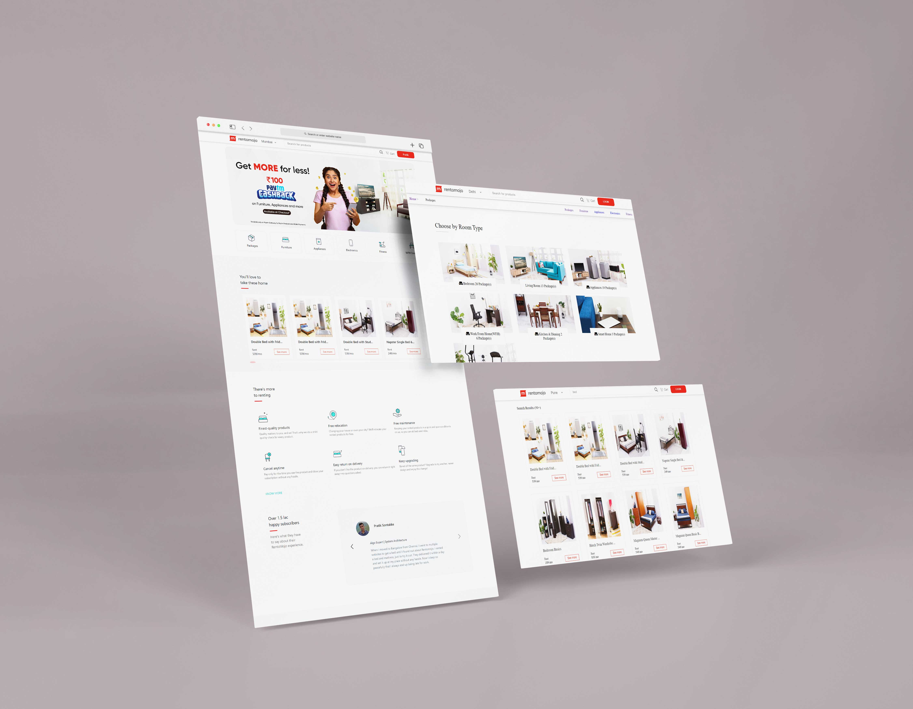
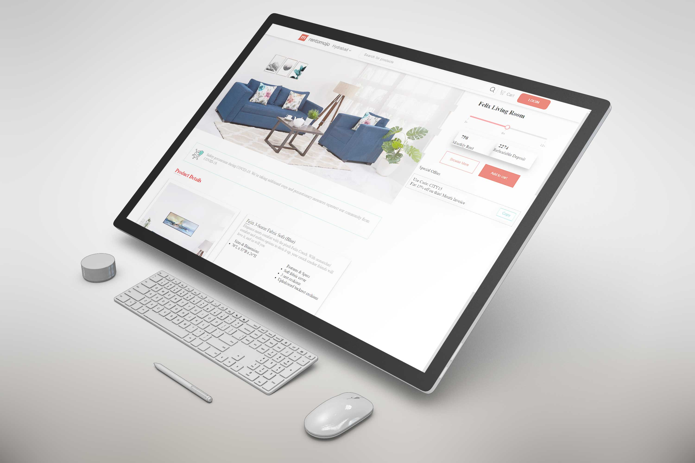
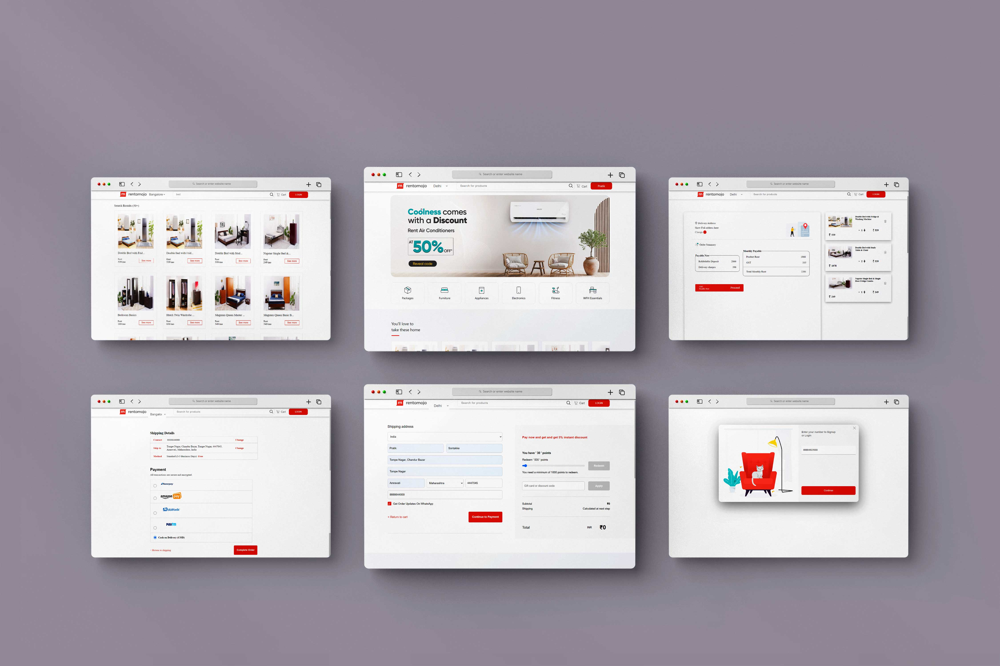

# rentomojo clone 

India's leading rental platform brings to you a wide range of products on rent. Experience the freedom to live the life you want, now.

## Deployed link of project
- <a href="https://jovial-dusk-c6ab4b.netlify.app">rentomojo.com (Clone)</a>

## Team Members

<ul>
  <li><a href="https://github.com/pratiksontakke">Pratik Sontakke</a></li>
  <li><a href="https://github.com/Samsursekh">Samsur Sekh</a></li>
  <li><a href="https://github.com/Mohit-6164">Mohit Raj Singh</a></li>
  <li><a href="https://github.com/Loki343">Kausik Bhaumik</a></li>
  <li><a href="https://github.com/iesparag">Parag Jain</a></li>
</ul>


## Deployment

On frontend terminal perform:

```bash
  Open index.html with live server
```


## 🛠 Tech Stack

- Boothstrap
- Material UI
- Javascript
- HTML
- CSS
- Local storage

## Functionality

- Login/Signup
- Authentication
- Admin page to add and delete product
- Add to cart
- Payment Page with Discount Functionality
- Search option to Search for product
- Checkout

## Website flow for User

- Home page

- Category wise products

- Search on navbar

- Product page(List of all products)

- Single product page

- Cart page

- Address page

- Payment page , One Time Password verification page.

- Login navbar section.
    - My Account Page.
    - My Setting Page.
    - Sign up Page.
        - OTP = 1234
        - Referral Code = ATM14
    - Login Page.
    

#### On address page use promo code - masai15

- you will  get 15% discount


#### Hard Coded Card details for payment section

- COD

#### Photo Gallery :






## Thank you note
Thank you all who is giving precious time to visit our little creative project which is made with lot of efforts.

_<p align="center"><sub>- Readme file designed by <a href="https://github.com/pratiksontakke">Pratik Sontakke</a> -</sub></p>_